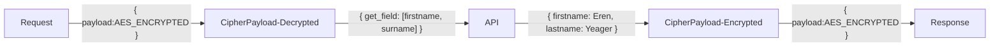
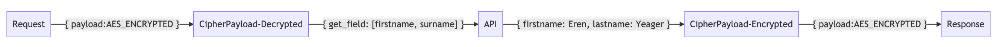

# Example Usage

## ☝️ Table of Contents

- [Example Usage](#example-usage)
  - [☝️ Table of Contents](#️-table-of-contents)
  - [📦 Dependencies](#-dependencies)
  - [⚒ Structure](#-structure)
  - [🏷 Versions](#-versions)
  - [⚙ Get Started](#-get-started)
    - [Step 1: Initialize](#step-1-initialize)
    - [Step 2: Go run `main.go`](#step-2-go-run-maingo)
    - [Step 3: Try to call: POST `/api/example` API](#step-3-try-to-call-post-apiexample-api)
  - [Tips: "Burn and Learn" with](#tips-burn-and-learn-with)

## 📦 Dependencies

- [x] Golang with GoFiber v2
- [x] Zerolog - Log Management

## ⚒ Structure



Alternative mermaid diagrams


## 🏷 Versions

v0.2.0

- Using 2-key pair for better securities

v0.1.0

- Initialized
- API Endpoint for Plaintext `POST` [http://localhost:5000/api/example](http://localhost:5000/api/example)
- API Endpoint for Ciphertext `POST` [http://localhost:8000/api/example](http://localhost:8000/api/example)

## ⚙ Get Started

### Step 1: Initialize

```bash
  go mod tidy
```

### Step 2: Go run `main.go`

```bash
  go run main.go
```

### Step 3: Try to call: POST `/api/example` API

```bash
curl --request POST --url http://localhost:8000/api/example --data '{"payload": "FDp1Dl31zGx5nRXFNKihB+k3ly/L7HI9tlHycbKVRwhaf3RRdyFGviuntEZqst0/"}'
{"payload":"bV5rjs84VS6onHizxuVPAg=="}
```

## Tips: "Burn and Learn" with

- [Postman](https://www.postman.com/)
- [VSCode Extension: REST Client](https://marketplace.visualstudio.com/items?itemName=humao.rest-client)
